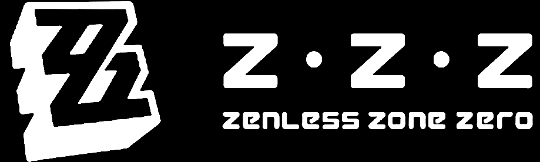
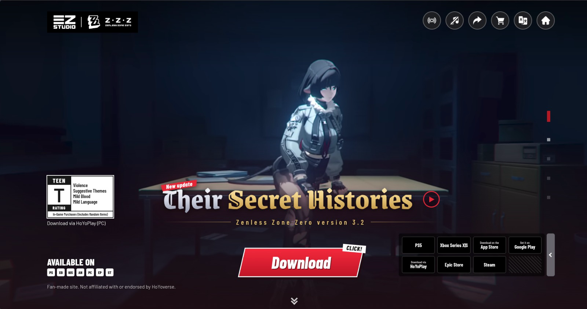
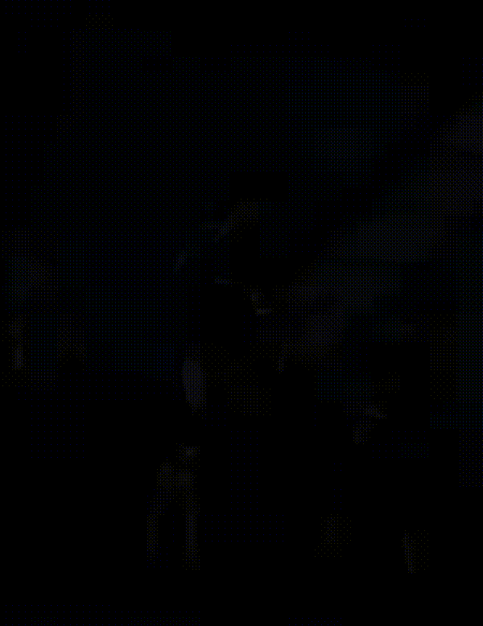

# 🎬 Zenless Zone Zero - Their Secret Histories (Fan-Made Landing Page)

An interactive landing page themed around **Zenless Zone Zero (Version 3.2: Their Secret Histories)**, built using pure HTML, CSS, and Vanilla JavaScript with a modular Single Page Application (SPA) architecture.

## 📸 Screenshot



## 🎬 Videos



## 🚀 Key Features

- **Pure Single Page Application (SPA)**: Dynamically fetches and switches page content using `fetch()` without heavy frameworks.
- **Responsive Design**: Layout automatically adapts across Mobile, Tablet, and Desktop devices.
- **Background Video Optimization**: Automatically selects video sources based on screen width (Shorts/Portrait for mobile, Widescreen for desktop).
- **Audio Control & Toast System**: Mute/unmute feature for background video and an interactive notification system for upcoming features.
- **Trailer Modal Dialog**: Integrated trailer video player utilizing the native HTML `<dialog>` element.
- **Pure CSS UI Components**: ESRB rating badge and UI ornaments crafted purely with HTML/CSS without additional static images.

## 🛠️ Technologies Used

- **HTML5 & CSS3** (Custom Properties / CSS Variables, Flexbox, CSS Grid)
- **Vanilla JavaScript (ES6+)**
- **Google Fonts** (*Grenze Gotisch*, *Barlow*, *Barlow Condensed*)
- **Vercel** (Hosting & Deployment)

## 📁 Directory Structure

```text
├── index.html          # Main entry point (SPA Shell)
├── css/
│   ├── main.css        # Root stylesheet (imports global & per-page styles)
│   ├── global.css      # CSS variables, reset, header, toast, side-nav
│   ├── page1.css       # Styles for main landing page
│   └── page2.css       # Styles for dummy / additional page
├── js/
│   ├── main.js         # SPA engine, router, & global action handlers
│   └── page1.js        # Page 1 logic (video, trailer modal, toggles)
├── html/
│   ├── page1.html      # Main landing page content markup
│   └── page2.html      # Second page (dummy) markup
├── pictures/           # Image assets & logos
└── videos/             # Background video assets & trailers
```

## ⚠️ Disclaimer

This project was created solely for educational, portfolio, and entertainment purposes (Fan-Made). All copyright, names, logos, characters, and related assets of Zenless Zone Zero belong to HoYoverse.