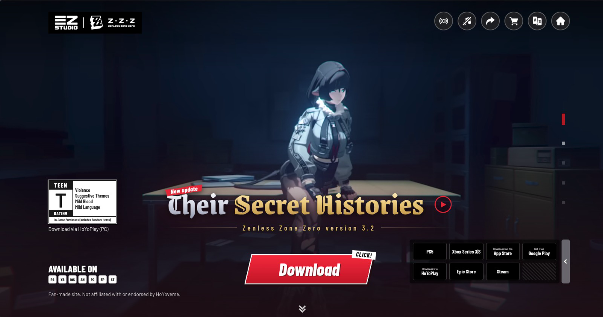
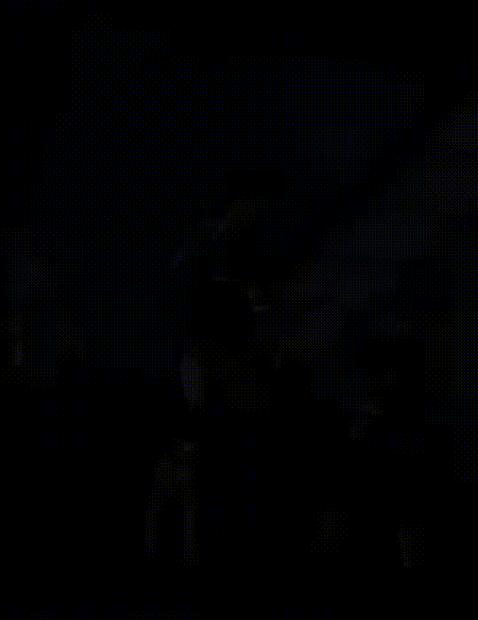

# 🎬 Fan-Made Website Template — Zenless Zone Zero: Their Secret Histories

Template website fan-made (tema **Zenless Zone Zero — Jane Doe**) yang dibangun dengan
**HTML + CSS + Vanilla JavaScript murni**, memakai arsitektur modular SPA
(Single Page Application) tanpa framework dan tanpa proses build.

> ### ⚡ Ada dua versi landing page di folder ini
>
> | Entry point |-stack | Build | Catatan |
> |---|---|---|---|
> | `index.html` | HTML + CSS murni + Vanilla JS (SPA 3 halaman) | tidak perlu | Versi asli proyek ini |
> | **`landing.html`** | **Tailwind CSS v4 + Vanilla JS (1 halaman)** | opsional | **Versi baru, cyberpunk/glassmorphism** |
>
> Mulai dari `landing.html` kalau kamu mau hasil bergaya ZZZ dengan Tailwind.
> Keduanya memakai asset lokal yang sama (`pictures/`, `videos/`, `audio/`),
> jadi tidak ada duplikasi aset. Detail di [🌐 Landing Page (Tailwind v4)](#-landing-page-tailwind-v4).

Proyek ini bisa langsung dipakai apa adanya, atau dijadikan **template** untuk
fan-site karakter/game lain — tinggal ganti warna, teks, dan asset
(panduan lengkap di bagian [🎨 Panduan Kustomisasi](#-panduan-kustomisasi-jadikan-template-milikmu)).

## 📸 Screenshot



## 🎬 Preview Video




---

## ✅ Kebutuhan (Requirements)

Semua yang diperlukan untuk menjalankan website ini:

- **Browser modern** apa pun (Chrome, Edge, Firefox, Safari — versi 2 tahun terakhir).
- **Local web server** — WAJIB, karena SPA memakai `fetch()` yang diblokir
  kalau file dibuka langsung (`file://`). Pilih salah satu:
  - Ekstensi **Live Server** di VS Code (paling gampang), atau
  - **Python** (`python3 -m http.server`), atau
  - **Node.js** (`npx serve`).
- **Tidak perlu install apa pun lagi**: tanpa npm, tanpa bundler, tanpa framework.
- Koneksi internet **hanya** untuk memuat Google Fonts (opsional — tanpa internet
  pun situs tetap jalan dengan font cadangan sistem).

## 🚀 Cara Menjalankan

1. Buka terminal di folder proyek ini.
2. Jalankan salah satu:
   - `python3 -m http.server 8000`, atau
   - `npx serve .`, atau
   - klik kanan `index.html` → **Open with Live Server** (VS Code).
3. Buka `http://localhost:8000` di browser.
4. Navigasi halaman lewat **dot di sisi kanan layar** atau URL hash
   (`#page1`, `#page2`, `#page3`).

---

## 📄 Daftar Halaman & Fitur

### Halaman 1 — Landing (`#page1`)

- Background video otomatis: **widescreen** (desktop/tablet) vs **portrait** (HP ≤ 640px),
  HP tidak ikut mengunduh video desktop yang besar.
- Judul teks murni (bukan gambar) dengan gradient silver/gold + stiker "New update".
- Tombol **Download** utama + panel platform lain yang bisa dilipat (PS5, Xbox,
  App Store, Google Play, HoYoPlay, Epic, Steam).
- **Trailer modal** memakai elemen `<dialog>` native (video baru dimuat saat tombol play ditekan).
- Lencana **rating umur** dan ikon platform dibuat dengan CSS murni.
- Tombol header: news (toast), **mute/unmute** video background, **share** (Web Share API /
  salin link), shop & bahasa (toast), home.

### Halaman 2 — Agent File (`#page2`)

- Konsep visual **"case file" kepolisian**: foto karakter dibingkai seperti foto arsip
  (asset PNG ber-background putih tetap terlihat natural), lengkap dengan penjepit kertas
  dan lencana pangkat **S** — semua CSS murni.
- Efek **tilt 3D** pada foto mengikuti kursor (otomatis nonaktif di layar sentuh /
  `prefers-reduced-motion`).
- Data karakter (attribute, specialty, faction, dll) dalam format definition list.
- **Combat Record**: tab skill (Basic / Dodge / Assist / Special / Chain / Core)
  dengan dukungan keyboard penuh (Arrow/Home/End) sesuai pola ARIA tabs.
  Isi skill di-render dari objek `SKILLS` di `js/page2.js` — mudah diganti.
- **Audio player theme song** custom (play/pause, slider seek, waktu),
  memakai asset lokal `audio/Page1_themeSong.mp3`. Otomatis berhenti saat pindah halaman.
- Watermark teks raksasa "JANE DOE" di background (CSS murni).

### Halaman 3 — Media Gallery (`#page3`)

- **Screenshots**: grid kartu + **lightbox** (`<dialog>`) untuk melihat gambar penuh.
- **Videos**: kartu video; file video **tidak dimuat sama sekali** sampai kartunya diklik,
  dan src dilepas lagi saat dialog ditutup (hemat bandwidth).
- **Fan Kit**: contoh pola tombol "coming soon" (mendemokan sistem toast).
- Menambah item galeri = cukup tambah kartu HTML baru dengan atribut
  `data-lightbox` / `data-video-src` — tanpa menyentuh JS.

### Fitur Global (semua halaman)

- SPA router berbasis URL hash dengan transisi fade antar halaman.
- Sistem **lifecycle per halaman**: `init()` dipanggil saat halaman tampil,
  `destroy()` saat ditinggalkan (listener bersih, audio/video berhenti).
- **Toast notification** global, dipicu lewat atribut `data-action="soon"`.
- Aksi global lewat `data-action`: `goto` (pindah halaman), `sound`, `share`, `soon`.
- Responsive penuh (mobile ≤ 640px, tablet 641–1023px, desktop ≥ 1024px).
- Aksesibilitas: `aria-label`, `aria-selected`, focus-visible, dukungan
  `prefers-reduced-motion` (video jadi frame diam, animasi dimatikan).

---

## 🌐 Landing Page (Tailwind v4)

Entry point: **`landing.html`** — satu halaman panjang (bukan SPA) bergaya
*urban cyberpunk / street anime*, dibangun dengan **Tailwind CSS v4** +
**Vanilla JavaScript** tanpa framework.

### Menjalankan

```bash
python3 -m http.server 8000     # lalu buka http://localhost:8000/landing.html
```

**Build Tailwind opsional.** Hasil kompilasi (`css/tailwind.css`) sudah
di-commit, jadi halaman tetap jalan **tanpa** Node/npm. Kalau mau mengubah
gaya/tampilan:

```bash
npm install          # hanya sekali, mengpasang @tailwindcss/cli
npm run build        # css/tailwind.src.css -> css/tailwind.css (minified)
npm run watch        # rebuild otomatis saat file diubah
```

File `css/tailwind.css` yang sudah di-commit sengaja **belum** di-minify
(±59 KB, ≈9 KB gzip) supaya mudah dibaca dan bisa diaudit. Jalankan
`npm run build` sebelum deploy untuk menghasilkan versi minified (±48 KB).

### Deploy ke Vercel

Vercel tidak mengenali proyek ini sebagai framework apa pun, jadi ia
memakai default **Output Directory = `public`**. Karena itu
`npm run build` punya dua tahap:

1. Tailwind CLI mengompilasi `css/tailwind.src.css` → `css/tailwind.css`.
2. `tools/build-static.mjs` menyalin seluruh file statis ke `public/`,
   yang menjadi folder yang benar-benar dilayani Vercel.

Kalau tahap 2 dilewati, build akan gagal dengan
`No Output Directory named "public" found after the Build completed`.

Tidak perlu mengubah apa pun di Dashboard Vercel — `vercel.json` sudah
menetapkan `buildCommand` dan `outputDirectory`.

`public/` tidak di-commit (ada di `.gitignore`), karena selalu dibangun ulang
di server.

### Isi halaman

- **Nav** — sticky + `backdrop-blur`, berubah jadi solid saat di-scroll,
  tombol mute/unmute, CTA *Play Now*, dan drawer khusus mobile.
- **Hero** — video background (desktop/tablet), poster ringan (mobile),
  gradient scrim, dua CTA, dan social rail melayang.
- **News** — 4 tab filter (All / News / Notice / Events) + 6 kartu
  dengan badge dan hover zoom.
- **Agents** — filter faksi + roster interaktif. Klik agent → portrait,
  stats, quote, dan warna tema berubah.
- **Media** — banner trailer, diputar lewat `<dialog>` tanpa reload.
- **Pre-Register** — form email dengan validasi client-side.
- **Footer** — copyright, rating umur, sosial, link legal.

### Konfigurasi Tailwind v4

Tidak ada `tailwind.config.js`. Semua token ada di
`css/tailwind.src.css` → blok `@theme`:

```css
@theme {
  --color-ink: #0b0d12;   /* background      */
  --color-glass: #161922; /* kartu            */
  --color-neon: #ff5500;  /* aksen utama      */
  --color-volt: #ffe600;  /* aksen sekunder   */
  --color-mist: #94a3b8;  /* teks redup       */
  --font-display: "Barlow Condensed", ...;
  --font-body: "Barlow", ...;
}
```

Utility kustom didefinisikan dengan `@utility` (bukan `@layer`), supaya
varian Tailwind tetap jalan di atasnya:

| Utility | Fungsi |
|---|---|
| `clip-notch-r`, `clip-notch-l`, `clip-corner` | bentuk bersudut / miring |
| `hazard` | garis diagonal kuning-hitam |
| `grid-bg`, `grid-bg-sm` | latar grid halus |
| `glow-accent`, `glow-accent-sm` | glow neon mengikuti `--accent` |
| `scanlines` | garis hologram |
| `text-outline`, `text-outline-neon` | teks kontur |
| `eyebrow` | label seksi uppercase |

### State & interaksi (Vanilla JS)

| Fitur | Pendekatan |
|---|---|
| Tab berita & filter faksi | radio input + varian `peer-checked:` (navigasi panah keyboard gratis) |
| State header / menu | `data-[scrolled=true]`, `data-[open=true]` |
| Agent terpilih | `data-[selected=true]` |
| Warna tema agent | CSS variable `--accent` + `rgb(from var(--accent) r g b / …)` |
| Trailer | `<dialog>` native, `src` video dipasang **saat** dialog dibuka |
| Scroll reveal | `IntersectionObserver`, sekali jalan |

Semua interaksi punya fallback tanpa JS: tab tetap ter-highlight lewat
`peer-checked:`, kartu berita tetap tampil, dan konten roster ada di HTML.

### Audit (opsional, dev)

```bash
node tools/audit-classes.mjs    # pastikan semua class ada di CSS hasil build
python3 tools/audit_html.py     # cek nesting tag, aset lokal, hook id JS
```

---

## 📁 Struktur Direktori

```text
├── index.html          # Kerangka SPA: font, favicon, #main-content, toast
├── landing.html        # Landing page Tailwind v4 (entry point baru)
├── css/
│   ├── main.css        # Root stylesheet (daftar @import semua css)
│   ├── global.css      # Token tema (:root), reset, header, side-nav, toast
│   ├── page1.css       # Gaya halaman landing
│   ├── page2.css       # Gaya halaman agent file
│   ├── page3.css       # Gaya halaman media gallery
│   ├── tailwind.src.css  # Sumber Tailwind v4 (@theme + @utility)
│   └── tailwind.css      # Hasil build Tailwind (di-commit)
├── js/
│   ├── main.js         # Mesin SPA: router, loader halaman, aksi global (data-action)
│   ├── page1.js        # Logika halaman 1 (video background, panel toko, trailer)
│   ├── page2.js        # Logika halaman 2 (tab skill, audio player, tilt foto)
│   ├── page3.js        # Logika halaman 3 (lightbox, dialog video)
│   └── landing.js      # Logika landing page Tailwind (tab, roster, modal)
├── html/               # Markup halaman SPA (page1/2/3.html)
├── tools/              # Script audit + build output (audit-classes, build-static)
├── pictures/           # Asset gambar & logo (lihat inventaris di bawah)
├── videos/             # Asset video background
├── audio/              # Asset musik (theme song)
└── public/             # Hasil `npm run build` — folder yang dilayani Vercel
```

---

## 🎨 Panduan Kustomisasi (Jadikan Template Milikmu)

### Ganti tema warna & font (1 tempat saja)

- Buka `css/global.css` → blok `:root`:
  - `--zzz-red`, `--zzz-gold`, dst → warna aksen karakter/game kamu.
  - `--font-display`, `--font-ui`, `--font-body` → nama font kamu.
- Ganti link Google Fonts di `index.html` kalau pakai font lain.

### Ganti identitas situs

- `index.html` → `<title>`, `<meta name="description">`, favicon (`pictures/janedoe_favicon.png`).
- `html/page1.html` → teks judul, stiker "New update", sub-judul versi, teks rating & platform.
- Logo header → ganti `pictures/studio_logo.png` dan `pictures/zzz_gamelogo.png`
  (dipakai ulang otomatis di semua halaman).

### Ganti karakter (halaman 2)

- Foto → timpa `pictures/JaneDoe.png` (rasio potret ~3:4 paling pas;
  background putih/polos menyatu dengan bingkai arsip).
- Nama, alias, quote, data → edit langsung di `html/page2.html`.
- Watermark → edit teks `.page2__watermark` di `html/page2.html`.
- Skill → edit **hanya** objek `SKILLS` di `js/page2.js` (tab & panel menyesuaikan otomatis).
- Musik → timpa file di `audio/` lalu sesuaikan `src` di `html/page2.html`.

### Ganti isi galeri (halaman 3)

- Screenshot baru → tambah `<button class="shot-card" data-lightbox data-full="..." data-caption="...">`.
- Video baru → tambah `<button class="video-card" data-video-src="..." data-caption="...">`.
- Tombol fan kit → ubah `data-msg` (teks toast) atau ganti jadi link `<a>` kalau file sudah ada.

### Tambah halaman baru (misal page4)

1. Buat `html/page4.html`, `css/page4.css`, dan (opsional) `js/page4.js`.
2. Daftarkan `@import url('page4.css');` di `css/main.css`.
3. Daftarkan di objek `PAGES` pada `js/main.js`.
4. Di `js/page4.js` isi: `window.ZZZ.pages.page4 = { init(page) {}, destroy() {} };`
5. Aktifkan dot navigasi ke-4 di semua `html/pageN.html`
   (hapus atribut `disabled`, tambahkan `data-action="goto" data-page="page4"`).

### Pola tombol yang belum punya tujuan

- Pakai `data-action="soon" data-msg="Pesan kamu"` → otomatis menampilkan toast.
- Kalau link sudah siap, ganti `<button>` menjadi `<a href="...">`.

---

## 🖼️ Inventaris Asset

### Dipakai di halaman

- `pictures/studio_logo.png`, `pictures/zzz_gamelogo.png` — logo header (semua halaman).
- `pictures/hero-poster.webp` — poster hero untuk `landing.html` (frame videonya
  diekstrak dari `Background_Page1.webm` pada detik ke-60, ±20 KB, WebP).
  Dipakai sebagai `poster` video dan sebagai gambar fallback di mobile.
- `pictures/signal.png`, `musical-note.png`, `share.png`, `grocery-store.png`,
  `language.png`, `home.png` — ikon tombol navigasi (icon hitam, dibalik putih via CSS `filter: invert`).
- `pictures/janedoe_favicon.png` — favicon situs.
- `pictures/JaneDoe.png` — foto karakter halaman 2 + item galeri halaman 3 (fan art, background putih).
- `pictures/preview.png` — screenshot situs, dipakai di galeri halaman 3, README,
  dan sebagai gambar kartu berita di `landing.html`.
- `pictures/zzz_icon.webp` — ikon game, item galeri halaman 3.
- `videos/Background_Page1.webm` — background halaman 1 (desktop) + trailer + video galeri. ⚠️ ~47 MB.
- `videos/Background_Page1.webm` juga jadi sumber trailer di `landing.html`
  (dimuat **saat** dialog dibuka) dan `Background_Page1_shorts.webm` (2,4 MB)
  dipakai sebagai teaser karakter.
- `audio/Page1_themeSong.mp3` — theme song di audio player halaman 2.

### Hanya dipakai di README (tidak dimuat situs)

- `pictures/bg-video.gif`, `pictures/bg-video_shorts.gif` — preview animasi dokumentasi (⚠️ ~61 MB, jangan dipasang di halaman).
- `pictures/zzz_logo.png` — logo cadangan.
- `pictures/margin.png` — sisa slicing lama; di situs sudah digantikan CSS murni (`.logo-divider`).

### Sumber eksternal (dimuat saat runtime)

- **Google Fonts**: Grenze Gotisch, Barlow, Barlow Condensed — satu-satunya resource internet.

---

## 📦 Dependensi

- **Runtime**: tidak ada. 100% HTML/CSS/JS murni.
- **Development**: tidak ada (tanpa npm, tanpa build step).
- **Eksternal saat runtime**: Google Fonts saja (lihat daftar di atas).

## ⚡ Tips Optimasi (opsional, sebelum deploy)

- Kompres `videos/Background_Page1.webm` (~47 MB) — misal dengan
  `ffmpeg -i input.webm -crf 30 -b:v 0 output.webm`.
- Kompres PNG besar (`JaneDoe.png`, `preview.png`, `janedoe_favicon.png`) lewat
  [squoosh.app](https://squoosh.app) atau `pngquant`.
- GIF di README (`pictures/bg-video*.gif`, total ±75 MB) sudah otomatis
  dilewati oleh `tools/build-static.mjs`, jadi tidak ikut ter-deploy.

## ⚠️ Disclaimer

Proyek ini dibuat semata untuk tujuan edukasi, portofolio, dan hiburan (**fan-made**).
Seluruh hak cipta, nama, logo, karakter, dan asset terkait Zenless Zone Zero adalah
milik **HoYoverse**. Data karakter diringkas dari wiki publik.
Situs ini tidak berafiliasi dengan dan tidak didukung oleh HoYoverse.
